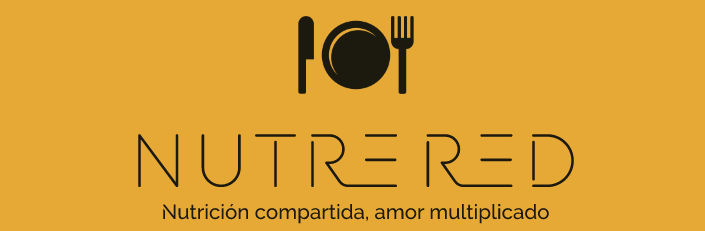

  

# NutreRed

**Nutrición compartida, amor multiplicado**

### Bienvenido a NutreRed

En NutreRed, estamos comprometidos en hacer una diferencia significativa en la lucha contra el desperdicio de alimentos y en mejorar la calidad de vida de comunidades vulnerables. Somos un puente entre empresas y restaurantes que tienen alimentos excedentes y organizaciones benéficas, asilos y comedores comunitarios que necesitan apoyo.

### Nuestra Misión

Nuestra misión es simple pero poderosa: reducir el desperdicio de alimentos y alimentar a quienes más lo necesitan. Conectamos a empresas y restaurantes con corazón a organizaciones locales, asegurando que los alimentos excedentes lleguen a manos hambrientas en lugar de desperdiciarse.

### Lo Que Hacemos

* Facilitamos conexiones entre donantes y beneficiarios.
* Coordinamos la logística de recolección y entrega de alimentos.
* Promovemos la sostenibilidad al reducir el desperdicio de alimentos.
* Contribuimos al bienestar de las comunidades locales.

## ¿Qué es este repositorio y cómo funciona?

Se presenta una aplicación web creada a partir de Flask, en Python3 y HTML5. El canal por el cual los usuarios de la página son llevados se resume en los siguientes puntos:

1. Proporcionar los datos de la organización
2. Ser redirigidos a una de dos páginas: para donantes o para beneficiarios
3.   

El programa es capaz de registrar a posibles donantes de comida, organizaciones como supermercados y restaurantes, y a posibles beneficiarios, como centros de acopio y asilos, almacenando su información.

## Consideraciones futuras

Habiendo contemplado la pregunta, _¿por qué en México las empresas no lo hacen ya?_, y entendiendo que en las empresas recae una responsabilidad muy grande de los alimentos que venden, parte de las acciones de NutreRed será el consolidad un proceso legal a partir del cual las empresas puedan deslindarse de responsabilidades a cerca de los alimentos que donan a través de NutreRed.

## Redstone Computing

  

Creado con mucha dedicación con el equipo de 'Redstone Engineers', conformado por:
- David
- Jacob
- Jean
- Ricardo  

